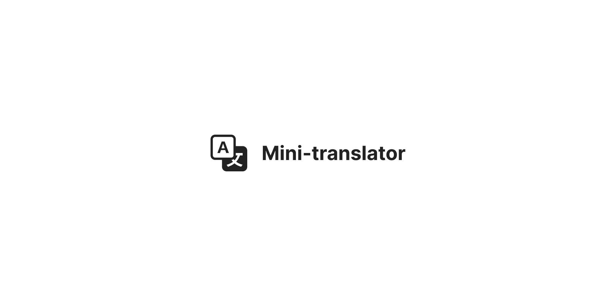

# Mini translator
Hi! 'mini-translator' is a handy project that I've been working on. It's a small and efficient tool for translating text between different languages. 
Whether you're trying to understand a foreign article or communicate with someone who speaks another language, 'mini-translator' has got you covered.

## Run locally
First, clone the project:
```
git clone https://github.com/Hctor11/mini-translator.git
```

Install the dependencies:
```
npm i
```

Then, run the development server:
```
npm run dev
# or
yarn dev
# or
pnpm dev
```
Open http://localhost:3000 with your browser to see the result.

## Tech Stack

